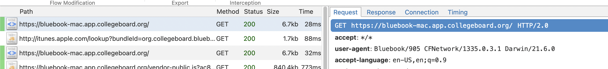

# On startup

(Not First Boot)

On startup, Bluebook will attempt to contact `http://itunes.apple.com/lookup?bundleId=org.collegeboard.bluebook` with a User Agent of "Bluebook/905 CFNetwork/1335.0.3.1 Darwin/21.6.0" and verify the version of the application.

Bluebook may or may not boot without this check.

Once the version check successfully passes, it loads `https://bluebook-mac.app.collegeboard.org` and starts rendering.

> 
> Bluebook loads the page twice, one with the "Bluebook/905" user agent, and one presumably reset user agent of "Mozilla/5.0 (Macintosh; Intel Mac OS X 10_15_7) AppleWebKit/605.1.15 (KHTML, like Gecko)"
> Unsure why this is happening, but attempting to load the page in a browser returns a version error, for both user agents.

Bluebook will load the page, which loads 5 JS files on load:

- https://bluebook-mac.app.collegeboard.org/vendor-public.js?ac8842221989527b7e75
- https://bluebook-mac.app.collegeboard.org/vendor-private.js?ac8842221989527b7e75
- https://bluebook-mac.app.collegeboard.org/main.js?ac8842221989527b7e75
- https://bluebook-mac.app.collegeboard.org/service-worker.js
  - This file does not have a hash at the end due to [Service Worker Best Practices](https://web.dev/articles/service-worker-lifecycle#avoid-url-change)
- https://bluebook-mac.app.collegeboard.org/workbox-1f2a78a2.js
  - Under the assumption that this is the generic Service Worker Workbox script.

Bluebook then attempts to load the next few files:

- https://bluebook.app.collegeboard.org/status.json
  Returns a JSON:

```json
{
  "outage": false
}
```

- https://dta.collegeboard.org/api/v1/content
  Returns the Translations(?) and textual content for in-app instructions
  i.e The directions to each exam, the lockdown instructions, etc

See [dta-content-uri.md](dta-content-uri.md) for more information.

> If you're not logged in, the [Login Procedure](authentication.md) occurs now.
> Otherwise, assume all requests that follow contain an Authorization header with the `cbJwtToken` returned from the auth request.
